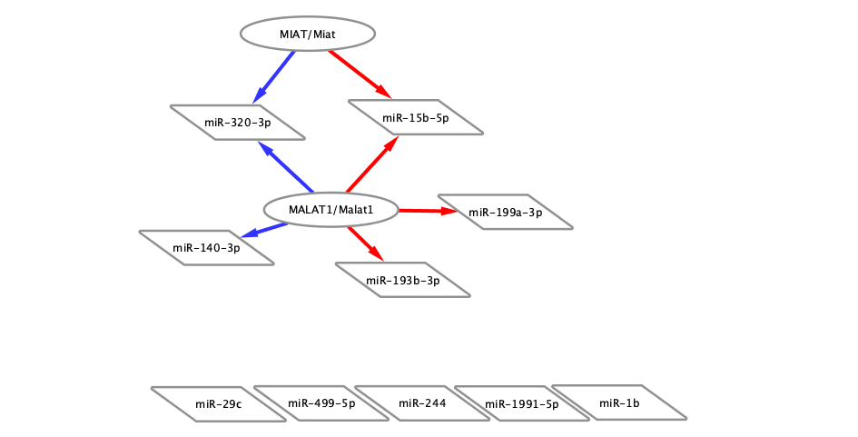
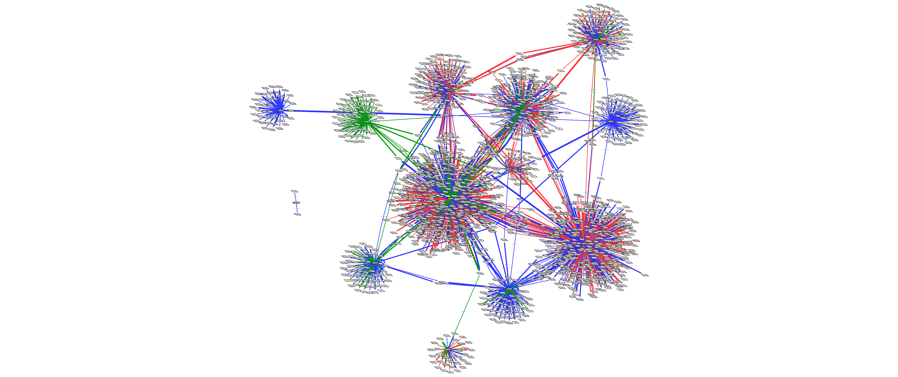
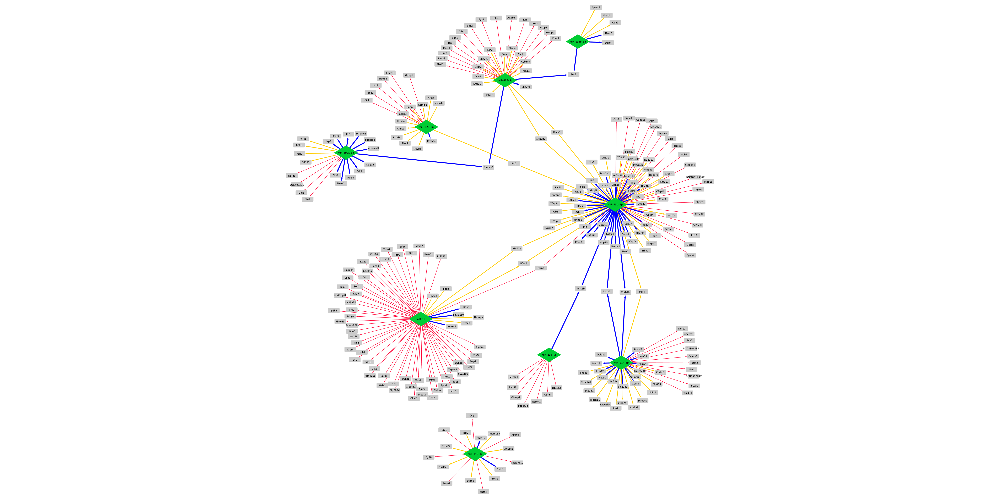
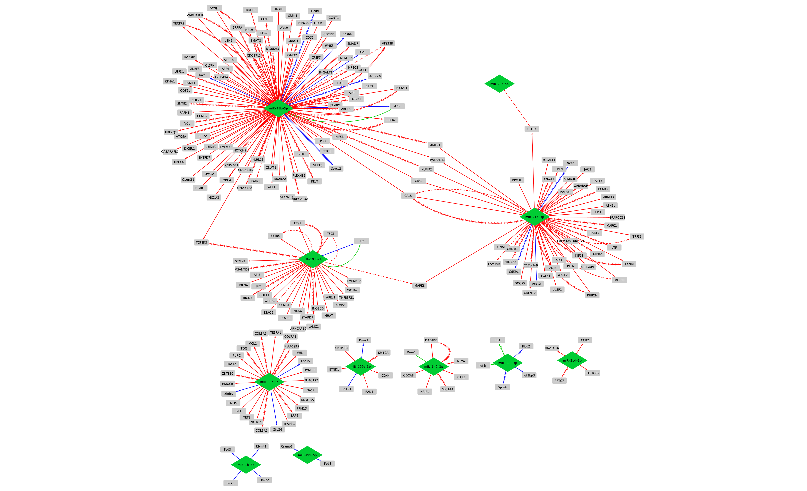
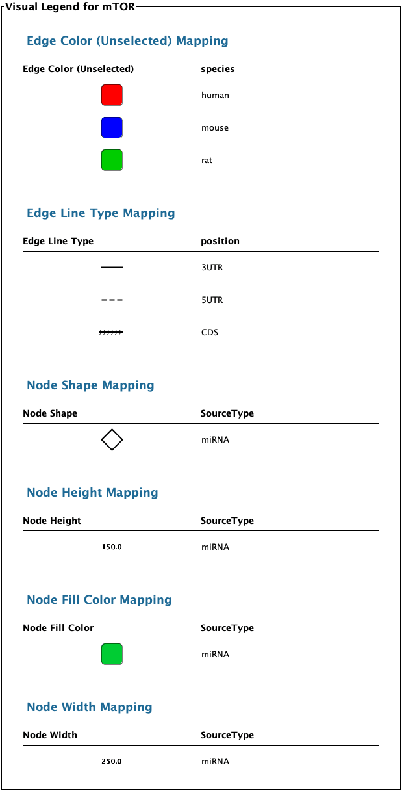

```{r setup, include=FALSE}
knitr::opts_chunk$set(echo = FALSE, fig.height=50, fig.width=10)

library(kableExtra)
library(ComplexHeatmap)
library(gplots)

setwd("~/Desktop/CCTR_Git_Repos/ASamidurai_mTOR")
```
# Project Goals

This project is studying the role of epigenetic regulation by microRNAs in diabetes mellitus (DM) during ischemia/reperfusion (I/R) injury.  During I/R, mTOR is active and is associated with Acute Myocardial Infarction (AMI).  The suppression of mTOR by Rapamycin (RAPA) during I/R provides cardioprotection.  This study is looking at the role miRNAs play during I/R with and without RAPA treatment. The primary goal of this analysis is to perform a differential expression analysis of the miRNA array data followed by a target analysis to see which genes these miRNAs are targeting.

**This report is focused on the Target Prediction analysis.**

# miRNAs of Interest

From the differential expression analysis, several miRNAs were chosen for target prediction analysis:

 * Downregulated miRNAs -  miR-1b, miR-1b-5p, miR-1b-3p; miR-29c-3p, miR-29c-5p; miR-193b-3p; miR-499-5p
 * Upregulated miRNAs - miR-15b-5p; miR-140-3p; miR-199a-3p ; miR-1991-5p; miR-214; miR-320-3p

__Note: miR-1991-5p was not found in the DIANA, miRDB, or mirBase databases for human, mouse, or rat species. Thus, target prediction was not performed for this miRNA.__

# LncRNA and miRNA Target Prediction

The DIANA database (https://diana.e-ce.uth.gr/lncbasev3/interactions) was used to identify which of the miRNAs listed above are predicted targets of the following LncRNAs in Human and Mouse:

 * MALAT1/U6
 * HOTAIR/U6
 * GAS5/U6
 * MIAT

The following network figure was generated from the Cytoscape file named "Data/Lnc-miRNA Analysis/LncRNA-miRNA_network_052020.cys" in the Google Drive folder.  



# miRNA - mRNA Target Prediction

Target prediction was done in 2 ways:

 * Searching miRDB only (http://www.mirdb.org/index.html)
 * Using miRWalk (http://mirwalk.umm.uni-heidelberg.de/) with overlap of miRDB and miRTarBase
 
For the miRWalk analysis, the number of interactions obtained from miRWalk alone was over 24k predited target sites, which is way to many to visualize.  Thus, this data was filtered to those interactions that were also in miRDB and in the manually curated database miRTarBase (http://mirtarbase.mbc.nctu.edu.tw/php/index.php) to provide a list of interactions with some type of validation.

## miRDB Analysis

The miRDB database target search tool was used to identify the predicted mRNA targets of each of the selected miRNAs listed above.  Human, mouse, and rat interactions were searched and placed in a spreadsheet for formatting and filtering.  This data is stored in the Google Sheets file "Data/miRNA-mRNA Analysis/miRDB Results/miRDB Results.gsheet".   Over 15k predicted targets were identified across the 3 species (first and second tabs).  Interactions were filtered down to the top candidates with a TargetScore >= 90 (1907 predicted target interactions total) for each species (3rd-6th tabs).  Cytoscape was used to import the predicted networks for visualization. A network was generated for each species individually, and for all species together.

### All species together:
The following network figure was generated from the Cytoscape file named "Data/miRDB Results/miRDBResults-TargetScore _90.cys" and contains 1,907 predicted target interactions.




### Only Human:
The following network figure was generated from the Cytoscape file named "Data/miRDB Results/miRDB_Results_TargetScore90_HumanOnly.cys" containing 771 predicted target interactions.


### Only Mouse:
The following network figure was generated from the Cytoscape file named "Data/miRDB Results/miRDB_Results_TargetScore90_HumanOnly.cys" containing 846 predicted target interactions.


### Only Rat:
The following network figure was generated from the Cytoscape file named "Data/miRDB Results/miRDB_Results_TargetScore90_RatOnly.cys" containing 290 predicted target interactions.




## miRWalk Analysis

The miRWalk analysis was performed by searching for the following mature miRNA IDs in human, mouse, and rat on the miRWalk site (http://mirwalk.umm.uni-heidelberg.de/):

 * miR-1b-3p
 * miR-1b-5p
 * miR-29c-3p
 * miR-29c-5p
 * miR-193b-3p
 * miR-499-5p
 * miR-15b-5p
 * miR-140-3p
 * miR-199a-3p
 * miR-1991-5p
 * miR-214-3p
 * miR-214-5p
 * miR-320-3p
 
The 3' UTR, 5' UTR, and CDS target sites were chosen if the were found in both miRDB and miRTarBase, and have a binding score >= 0.95.  I tried 0.90 but it kept freezing when I ran the filter for mouse, so I can try again later if it would be helpful.

The network for these predicted interactions is below followed by the legend and was generated from the cytoscape file "Data/miRWalk Results/miRWalk_Results_AllSpecies_Validated.tsv.cys".  The interactions have been compiled in the Google Sheets file "miRWalk_Results.gsheet".







